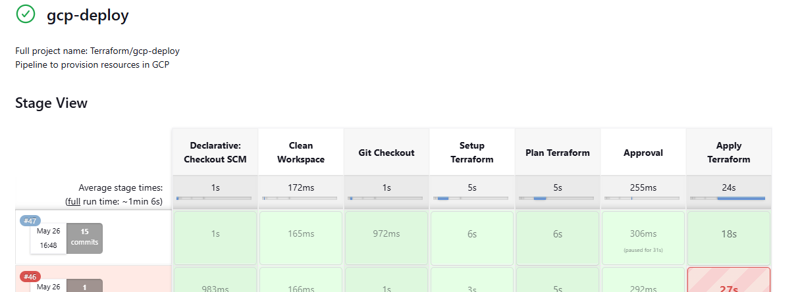
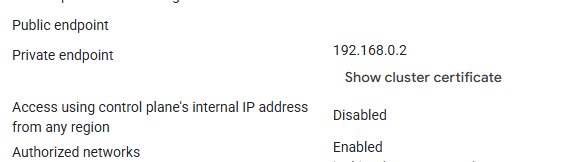
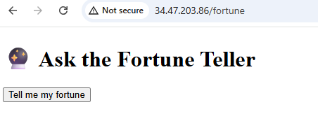
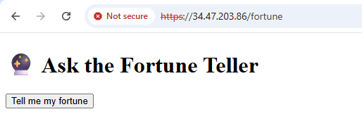
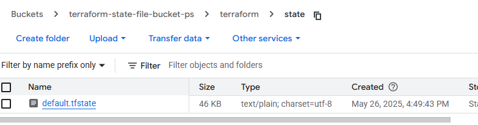

# Microservices Deployment on GCP with Jenkins & Terraform

Firstly, I will create Jenkins VM and create a CI/CD pipeline to deploy GCP resources using terraform.

---

## 🚀 Jenkins Setup

1. **Create a Service Account** (`jenkins-sa@<project_id>.iam.gserviceaccount.com`) with the following roles:

    - `roles/config.agent`  
    - `roles/compute.admin`  
    - `roles/iam.serviceAccountUser`  
    - `roles/storage.admin`  
    - `roles/iam.serviceAccountTokenCreator`  
    - `roles/iam.serviceAccountAdmin`  
    - `roles/container.admin`  
    - `roles/resourcemanager.projectIamAdmin`  
    - `roles/artifactregistry.writer`  

3. **Create a Jenkins VM from GCP Marketpalce** using the service account above. After deployment:
    - Find the **username and password** in the **Details** tab.
    - Access Jenkins UI via the **external IP address**.

    

---

## ⚙️ Install Terraform

4. SSH into the Jenkins VM and run:

```bash
sudo apt update
wget -O - https://apt.releases.hashicorp.com/gpg | sudo gpg --dearmor -o /usr/share/keyrings/hashicorp-archive-keyring.gpg
echo "deb [arch=$(dpkg --print-architecture) signed-by=/usr/share/keyrings/hashicorp-archive-keyring.gpg] \
https://apt.releases.hashicorp.com $(grep -oP '(?<=UBUNTU_CODENAME=).*' /etc/os-release || lsb_release -cs) main" \
| sudo tee /etc/apt/sources.list.d/hashicorp.list
sudo apt update && sudo apt install terraform
terraform --version  # Verify installation
```
☁️ Terraform Setup <br>
5. Create a GCS bucket to store the Terraform state files (manually or via gcloud).

6. Write your Terraform code and push it to GitHub.

7. Create a Jenkins pipeline to run Terraform commands and provision resources.

🔐 Kubernetes Cluster SA<br>
Create a Service Account for GKE, and grant the following roles:
- roles/artifactregistry.reader
- roles/logging.logWriter
- roles/storage.admin

🐳 Build & Push Microservices (Docker images)<br>
Python App:
```bash
docker build -t asia-south1-docker.pkg.dev/microservices-test-ps/python-app/fortune-teller:v1 .
gcloud auth configure-docker asia-south1-docker.pkg.dev
docker push asia-south1-docker.pkg.dev/microservices-test-ps/python-app/fortune-teller:v1
```
☕ Java App (Spring Boot):<br>
Build the JAR:
```bash
mvn clean install  # This creates target/weather-service-1.0.0.jar
Build & Push Docker Image:
```
Build the image:
```bash 
docker build -t asia-south1-docker.pkg.dev/microservices-test-ps/java-app/weather-service:v1.0 .
docker push asia-south1-docker.pkg.dev/microservices-test-ps/java-app/weather-service:v1.0
```

🌐 Ingress Controller<br>
Install Ingress Controller with Helm:
```bash
helm repo add ingress-nginx https://kubernetes.github.io/ingress-nginx
helm repo update
helm install ingress-nginx ingress-nginx/ingress-nginx \
  --namespace ingress-nginx --create-namespace \
  -f ingress-controller-values.yaml
```
Images referenced by the Ingress Controller could not be pulled to the cluster, so I pulled the image into my local, retagged it and pushed it to Artifact Registry. Then updated the image path in the custom 'ingress-controller-values.yaml' file.

Pull and Push Ingress Images to Artifact Registry:

### Controller
```bash
docker pull registry.k8s.io/ingress-nginx/controller:v1.12.2
docker tag registry.k8s.io/ingress-nginx/controller:v1.12.2 \
  asia-south1-docker.pkg.dev/microservices-test-ps/ingress-nginx/controller:v1.12.2
docker push asia-south1-docker.pkg.dev/microservices-test-ps/ingress-nginx/controller:v1.12.2
```
### CertGen
```bash
docker pull registry.k8s.io/ingress-nginx/kube-webhook-certgen:v1.5.3
docker tag registry.k8s.io/ingress-nginx/kube-webhook-certgen:v1.5.3 \
  asia-south1-docker.pkg.dev/microservices-test-ps/ingress-nginx/kube-webhook-certgen:v1.5.3
docker push asia-south1-docker.pkg.dev/microservices-test-ps/ingress-nginx/kube-webhook-certgen:v1.5.3
```

🔧 Additional Steps<br>
- Add health checks for both apps (Spring Boot & Python Flask).
- Reserve a static regional IP for the Kubernetes load balancer.
- Update values.yaml of the Ingress Controller to use the static IP.
- SSL configuration is not applied in this project due to lack of a domain.
- Enabled Horizontal Pod Autoscaling (HPA) in the Helm charts.

🐍 Python Automation<br>
Install dependencies for GKE automation in your Jenkins Server:
```bash
apt install python3-pip
apt-get install google-cloud-sdk-gke-gcloud-auth-plugin
pip install kubernetes
pip install google-cloud-container
```
🔥 Firewall Rules<br>
Few Firewall rules are automatically created when deploying the NGINX ingress controller.

--------------------------------------------------------------------------------------------------------------------------------------------------------
Cloud Services Exercise:
1. All infrastructure provisioning should be automated using Terraform.
    a) Local/Remote terraform state can be used.<br>
`Soln: Yes, I have used Jenkins to create a Pipeline that automates the deployment of GCP resources using Terraform.` <br>
[Pipeline script](./Jenkinsfile-terraform)


2. Use Custom VPC.<br>
`Soln: Yes, I have used a custom VPC.` <br>
[Terraform file for VPC](./terraform/env/dev/vpc.tf)

3. GKE Cluster Should not be public.<br>
`Soln: Yes, the public endpoint of control plane has been disabled, so only reasources within the same VPC can reach the control plane.`


4. Microservice should be deployed and managed using helm charts.<br>
`Soln: I have created helm charts for the microservices.`<br>
[helm-charts](./my-helm)
```bash
helm install ingress-nginx ingress-nginx/ingress-nginx \
  --namespace ingress-nginx --create-namespace \
  -f ingress-controller-values.yaml

helm install fortune-teller-app fortune-teller
helm install weather-service-app weather service
```

5. Microservices should be exposed via Ingress.<br>
`Soln: Yes, I am using an Nginx Ingress Contoller`
```bash
helm repo add ingress-nginx https://kubernetes.github.io/ingress-nginx
```
6. Microservice should be accessible using a DNS (http or https)<br>
`Soln: Microservices are accessible using the External IP address of the load balancer.`<br>
http:<br>
<br>
https:<br>



7. Add unit test for terraform code using Terragrunt.<br>
`Soln: Apologies, need more time to explore Terragrunt as I have not used it before.`

8. Create an external data source (use Python script) to create firewall rules with GKE:<br>
`Soln: I have used python to gather the IPs of the worker nodes and control plane endpoint, and then create a firewall rule using these information. The terraform code of the firewall rule is commited to the terraform repo and then the jenkins pipeline is triggered to create the Firewall rule.`<br>
[python-automation-jenkinsfile](./automation/Jenkinsfile)<br>
[python-automation-code](./automation/test.py)

9. Setup health checks for microservices.<br>
`Soln: Yes, I have setup health checks using readiness and liveness probes.`
[health-check](./my-helm/fortune-teller/values.yaml)

10. Securing microservices using HTTPS.<br>
`Soln: Apologies as this could not be done. I need a domain to host the application and then issue SSL certificates.`

11. Using remote terraform state.<br>
`Soln: Yes, I have configured remote terraform state.`<br>
[terraform-backend-confiuration](./terraform/env/dev/terraform.tf)<br>
