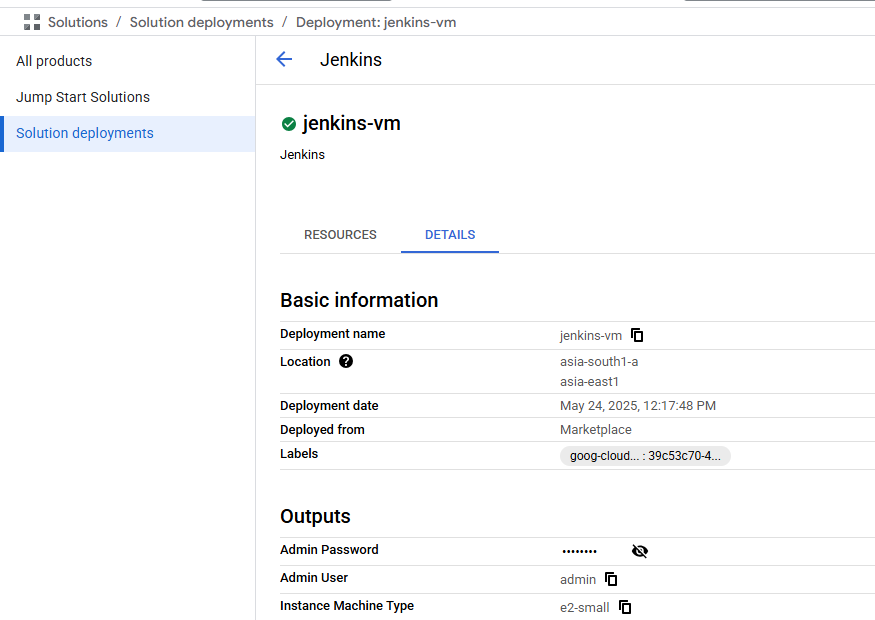

# microservices-test

Firstly, I will create a Jenkins VM from marketplace
Create a service account for Jenkins with below permissions (jenkins-sa@microservices-test-ps.iam.gserviceaccount.com):-
roles/config.agent
roles/compute.admin
roles/iam.serviceAccountUser
roles/storage.admin

Enabled APIs
Compute Engine API 
Infrastructure Manager API 

Fill the details and deploy the jenkins VM. Once the deployment is completed, you can find the username and password in the Details tab.

Now, ssh into the VM and install Terraform 
1. sudo apt update
2. wget -O - https://apt.releases.hashicorp.com/gpg | sudo gpg --dearmor -o /usr/share/keyrings/hashicorp-archive-keyring.gpg
echo "deb [arch=$(dpkg --print-architecture) signed-by=/usr/share/keyrings/hashicorp-archive-keyring.gpg] https://apt.releases.hashicorp.com $(grep -oP '(?<=UBUNTU_CODENAME=).*' /etc/os-release || lsb_release -cs) main" | sudo tee /etc/apt/sources.list.d/hashicorp.list
sudo apt update && sudo apt install terraform
3. run 'terraform --version' to verify successful installation
4. Create a bucket manually to store terraform state file

